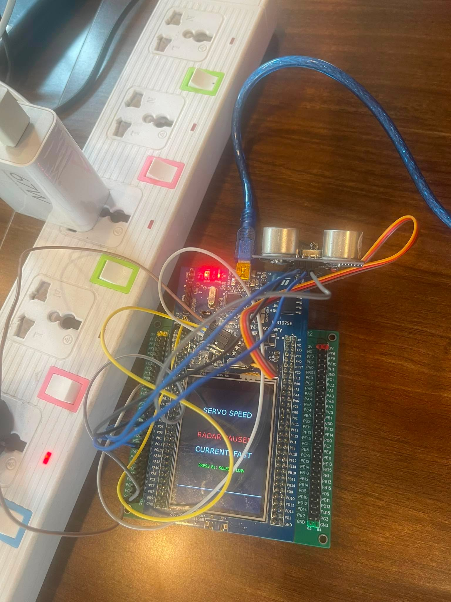
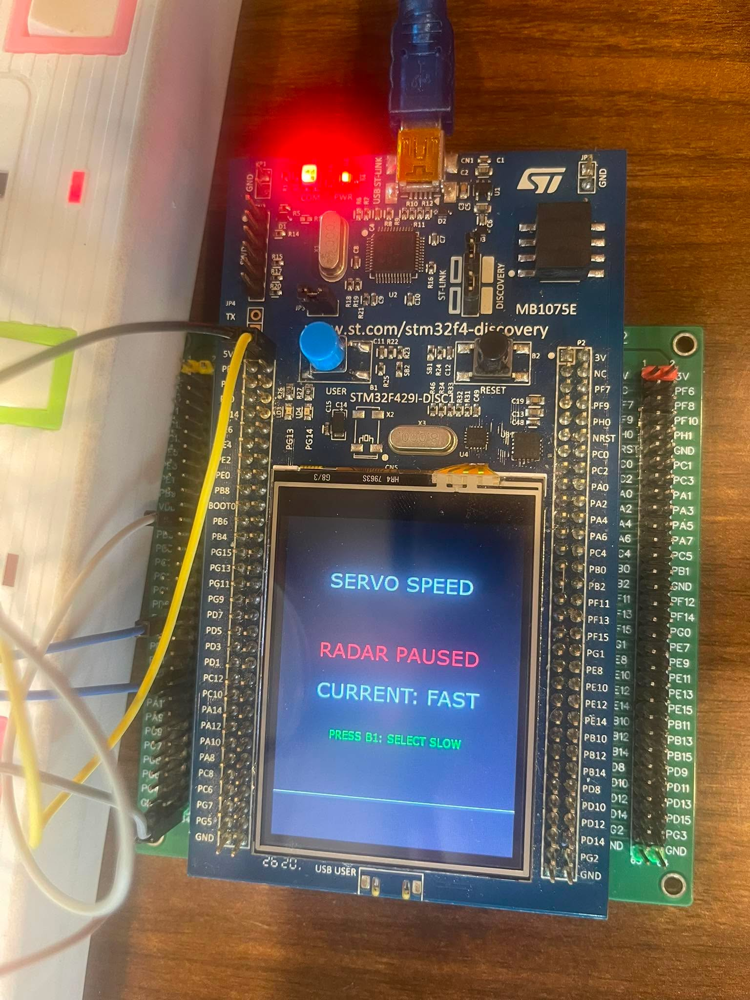
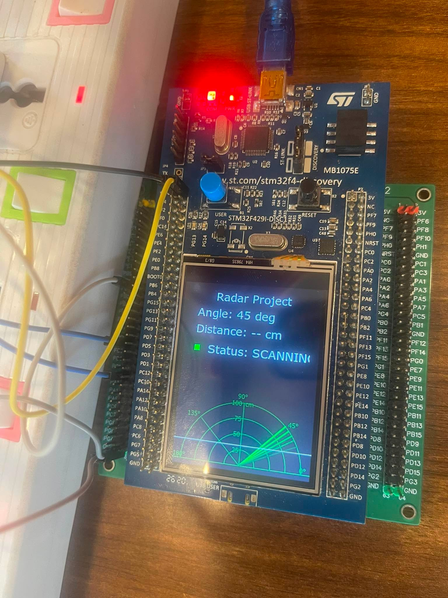

# BÀI TẬP LỚN - SHORT RANGE RADAR

Hệ thống radar tầm ngắn sử dụng STM32F429I-DISC1, cảm biến HC-SR04, servo MG90S và giao diện TouchGFX.

**Repository:** [Hungcuong2005/ShortRangeRadar](https://github.com/Hungcuong2005/ShortRangeRadar)

## GIỚI THIỆU

**Đề bài/Mục tiêu sản phẩm:**  
Thiết kế mô hình radar tầm ngắn có khả năng quét vật cản trong dải 0°–180°, đo khoảng cách bằng cảm biến siêu âm và hiển thị vị trí mục tiêu trên màn hình LCD của STM32F429I-DISC1.

**Hướng tiếp cận:**  
HC-SR04 được gắn trên servo MG90S. STM32 điều khiển servo quay theo từng bước 5°, phát xung TRIG và đo thời gian ECHO bằng Input Capture. Dữ liệu góc và khoảng cách được gửi qua hàng đợi FreeRTOS tới TouchGFX để cập nhật giao diện. State machine được sử dụng để hệ thống không chặn CPU trong lúc chờ servo hoặc cảm biến.

**Sản phẩm:**

1. Quét hai chiều trong phạm vi 0°–180°.
2. Đo khoảng cách bằng HC-SR04 và xử lý trường hợp mất ECHO.
3. Hiển thị góc, khoảng cách (giới hạn hiển thị giao diện từ 2 cm đến 100 cm), tia quét và vị trí mục tiêu trên TouchGFX.
4. Lựa chọn tốc độ FAST hoặc SLOW bằng nút USER (nhấn giữ 1s để mở giao diện cài đặt tốc độ, nhấn nhả để đổi tốc độ và tiếp tục quét).

**Ảnh chụp minh họa:**




---

## TÁC GIẢ

- **Tên nhóm:** TO LẮM
- **Lớp học phần:** IT4210
- **Giảng viên hướng dẫn:** ThS. Nguyễn Đức Tiến

| STT | Họ tên | MSSV | Công việc |
| ---: | --- | --- | --- |
| 1 | Phạm Quang Trung | 20235445 | Cấu hình STM32 và tích hợp hệ thống |
| 2 | Nguyễn Tùng Dương | 20235311 | Driver HC-SR04 và RadarTask |
| 3 | Phạm Hùng Cường | 20235286 | Điều khiển servo|
| 4 | Trần Bá Dân | 20235291 | Thiết kế giao diện TouchGFX |

---

## MÔI TRƯỜNG HOẠT ĐỘNG

Hệ thống hoạt động trên bo STM32F429I-DISC1, sử dụng màn hình LCD-TFT tích hợp và các module ngoại vi được nối trực tiếp với vi điều khiển.

**Bill of materials**

| STT | Linh kiện | Số lượng | Vai trò |
| ---: | --- | ---: | --- |
| 1 | STM32F429I-DISC1 | 1 | Xử lý trung tâm và hiển thị |
| 2 | HC-SR04 | 1 | Đo khoảng cách |
| 3 | Servo MG90S | 1 | Quay cảm biến theo góc quét |
| 4 | Mạch chia áp hoặc level shifter | 1 | Hạ mức tín hiệu ECHO |
| 5 | Nguồn 5 V ngoài | 1 | Cấp nguồn cho servo và cảm biến |
| 6 | Dây nối và keo nến | Theo nhu cầu | Kết nối, cố định cảm biến lên servo |

**Công cụ phát triển**

| Công cụ/thư viện | Phiên bản hoặc cấu hình |
| --- | --- |
| STM32CubeMX | 6.17.0 |
| STM32CubeF4 | V1.28.2 |
| TouchGFX | 4.25.0 |
| FreeRTOS | CMSIS-RTOS v2 |
| Màn hình | 240 × 320, RGB565 |


---

## SƠ ĐỒ SCHEMATIC

### Kết nối tín hiệu

| STM32F429I-DISC1 | Module ngoại vi | Chức năng |
| --- | --- | --- |
| PD4 | HC-SR04 TRIG | Phát xung kích cảm biến |
| PA15 / TIM2_CH1 | HC-SR04 ECHO | Đo độ rộng xung bằng Input Capture |
| PB7 / TIM4_CH2 | MG90S Signal | PWM điều khiển servo |
| PA0 | Nút USER trên bo | Chọn chế độ FAST/SLOW |
| 5 V | HC-SR04 VCC | Cấp nguồn cảm biến |
| GND | HC-SR04 và MG90S GND | Nối chung mass toàn hệ thống |

```text
                         +----------------------+
Nút USER PA0 ---------->|                      |
HC-SR04 ECHO ---------->|   STM32F429I-DISC1   |----> LCD TouchGFX
       qua mạch hạ mức   |                      |
HC-SR04 TRIG <----------|                      |
Servo PWM <-------------|                      |
                         +----------------------+
```


**Ảnh sơ đồ mạch:**

> Bổ sung hình schematic hoặc ảnh đấu nối thực tế tại đây.

---

## TÍCH HỢP HỆ THỐNG

### Thành phần phần cứng

- **STM32F429I-DISC1:** điều khiển toàn bộ quá trình quét, đo và hiển thị.
- **HC-SR04:** phát và thu sóng siêu âm để xác định khoảng cách.
- **MG90S:** quay cảm biến trong dải 0°–180°.
- **LCD-TFT:** hiển thị radar, góc và khoảng cách.
- **Nút USER:** nhấn giữ 1s để tạm dừng quét và mở menu cấu hình tốc độ, nhấn nhả để chuyển đổi giữa FAST và SLOW và quay lại chế độ quét.

### Thành phần phần mềm

| Thành phần | Vị trí | Vai trò |
| --- | --- | --- |
| Driver HC-SR04 | [`Core/Src/hcsr04.c`](Core/Src/hcsr04.c) | Phát TRIG, bắt ECHO và xử lý timeout |
| RadarTask | [`Core/Src/main.c`](Core/Src/main.c) | Chạy state machine và điều khiển servo |
| FreeRTOS Queue | `radarQueue` | Truyền mẫu đo từ RadarTask sang giao diện |
| Screen1View | [`Screen1View.cpp`](TouchGFX/gui/src/screen1_screen/Screen1View.cpp) | Nhận dữ liệu và cập nhật trạng thái |
| RadarWidget | [`RadarWidget.cpp`](TouchGFX/gui/src/common/RadarWidget.cpp) | Vẽ lưới radar, tia quét và mục tiêu |

### Luồng hoạt động

1. Servo được đưa tới góc hiện tại.
2. Hệ thống chờ servo ổn định 80 ms ở FAST hoặc 150 ms ở SLOW.
3. STM32 phát xung TRIG dài 10 µs.
4. TIM2 bắt cạnh lên và cạnh xuống của ECHO với độ phân giải 1 µs.
5. Khoảng cách được tính theo công thức:

```text
distance_mm = pulse_width_us × 10 / 58
```

6. Mẫu gồm góc, khoảng cách và trạng thái hợp lệ được gửi vào `radarQueue`.
7. TouchGFX lấy mẫu mới nhất, lọc khoảng cách mục tiêu hợp lệ trong phạm vi hiển thị (từ 2 cm đến 100 cm) và cập nhật màn hình.
8. Góc tăng hoặc giảm 5°; hệ thống đổi hướng tại 0° và 180°.

Nếu không nhận đủ tín hiệu ECHO trong 30 ms, driver kết thúc phép đo bằng timeout. Cơ chế này giúp RadarTask tiếp tục chạy thay vì bị kẹt tại một góc.

---

## ĐẶC TẢ HÀM

### 1. Khởi động phép đo HC-SR04 ([Core/Src/hcsr04.c](file:///c:/TouchGFXProjects/ShortRangeRadar/Core/Src/hcsr04.c))
```c
bool HCSR04_StartMeasurement(void)
{
    if (hcsr04_measurement_in_progress != 0U)
    {
        return false;
    }

    uint32_t primask = __get_PRIMASK();
    __disable_irq();

    if (hcsr04_measurement_in_progress != 0U)
    {
        if (primask == 0U)
        {
            __enable_irq();
        }
        return false;
    }

    hcsr04_measurement_in_progress = 1U;
    hcsr04_measurement_ready = 0U;
    hcsr04_state = HCSR04_STATE_WAIT_RISING;
    
    __HAL_TIM_SET_CAPTUREPOLARITY(&htim2, TIM_CHANNEL_1, TIM_INPUTCHANNELPOLARITY_RISING);

    if (primask == 0U)
    {
        __enable_irq();
    }

    hcsr04_start_tick = osKernelGetTickCount();
    HCSR04_TriggerPulse();

    return true;
}
```
**Mô tả:** Phát xung TRIG dài 10 µs và chuẩn bị cài đặt Timer 2 Input Capture bắt tín hiệu ECHO. Hàm trả về `true` khi khởi động đo thành công, hoặc `false` nếu phép đo trước đó đang bận.

### 2. Lấy kết quả đo HC-SR04 ([Core/Src/hcsr04.c](file:///c:/TouchGFXProjects/ShortRangeRadar/Core/Src/hcsr04.c))
```c
bool HCSR04_GetResult(HCSR04_Result *result)
{
    if (result == NULL)
    {
        return false;
    }

    if (hcsr04_measurement_ready == 0U)
    {
        return false;
    }

    uint32_t primask = __get_PRIMASK();
    __disable_irq();

    if (hcsr04_measurement_ready == 0U)
    {
        if (primask == 0U)
        {
            __enable_irq();
        }
        return false;
    }

    uint32_t pulse_us = hcsr04_pulse_width_us;
    HCSR04_State state = hcsr04_state;
    hcsr04_measurement_ready = 0U;

    if (primask == 0U)
    {
        __enable_irq();
    }

    result->pulse_width_us = pulse_us;

    if (state == HCSR04_STATE_DONE)
    {
        result->distance_mm = ((uint32_t)pulse_us * 10U) / 58U;
        if (result->distance_mm >= 20U && result->distance_mm <= 4000U)
        {
            result->valid = 1U;
        }
        else
        {
            result->valid = 0U;
        }
    }
    else
    {
        result->distance_mm = 0U;
        result->valid = 0U;
    }

    return true;
}
```
**Mô tả:** Đọc kết quả độ rộng xung đo được từ hàng đợi capture và tính toán khoảng cách theo mm. Hàm trả về `true` khi đã có kết quả mới, ngược lại trả về `false`.

### 3. Xử lý Timeout của Driver ([Core/Src/hcsr04.c](file:///c:/TouchGFXProjects/ShortRangeRadar/Core/Src/hcsr04.c))
```c
void HCSR04_ProcessTimeout(uint32_t current_tick)
{
    if (hcsr04_measurement_in_progress != 0U && (current_tick - hcsr04_start_tick) >= HCSR04_TIMEOUT_MS)
    {
        uint32_t primask = __get_PRIMASK();
        __disable_irq();
        
        if (hcsr04_measurement_in_progress != 0U &&
            (hcsr04_state == HCSR04_STATE_WAIT_RISING || hcsr04_state == HCSR04_STATE_WAIT_FALLING) &&
            (current_tick - hcsr04_start_tick) >= HCSR04_TIMEOUT_MS)
        {
            hcsr04_state = HCSR04_STATE_TIMEOUT;
            hcsr04_measurement_in_progress = 0U;
            hcsr04_measurement_ready = 1U;
            hcsr04_pulse_width_us = 0U;
            
            __HAL_TIM_SET_CAPTUREPOLARITY(&htim2, TIM_CHANNEL_1, TIM_INPUTCHANNELPOLARITY_RISING);
        }
        
        if (primask == 0U)
        {
            __enable_irq();
        }
    }
}
```
**Mô tả:** Được gọi liên tục trong vòng lặp chính của task để giải phóng trạng thái driver sang IDLE nếu cảm biến HC-SR04 không gửi tín hiệu ECHO trả về sau 30 ms.

### 4. Thiết lập góc quay Servo ([Core/Src/main.c](file:///c:/TouchGFXProjects/ShortRangeRadar/Core/Src/main.c))
```c
static void Servo_SetAngleDeg(uint16_t angle_deg)
{
  /* Clamp angle */
  if (angle_deg > SERVO_MAX_ANGLE_DEG)
  {
    angle_deg = SERVO_MAX_ANGLE_DEG;
  }

  /* Linear mapping */
  /* Cast to uint32_t to prevent overflow in intermediate multiplication */
  uint16_t pulse_us = (uint16_t)(SERVO_MIN_PULSE_US
      + (((uint32_t)angle_deg * (SERVO_MAX_PULSE_US - SERVO_MIN_PULSE_US) + (SERVO_MAX_ANGLE_DEG / 2))
        / SERVO_MAX_ANGLE_DEG));

  Servo_SetPulseUs(pulse_us);
}
```
**Mô tả:** Chuyển đổi tuyến tính góc chỉ định (0–180 độ) thành độ rộng xung PWM từ 550 µs đến 2450 µs để ghi đè vào thanh ghi so sánh của Timer 4 Channel 2.

### 5. Cập nhật mẫu đo cho RadarWidget ([TouchGFX/gui/src/common/RadarWidget.cpp](file:///c:/TouchGFXProjects/ShortRangeRadar/TouchGFX/gui/src/common/RadarWidget.cpp))
```cpp
void RadarWidget::setSample(uint16_t angle, uint16_t distanceMm, uint8_t valid)
{
    if (angle == lastSampleAngle && distanceMm == lastSampleDistance && valid == lastSampleValid)
    {
        return;
    }

    uint16_t clampedAngle = angle;
    if (clampedAngle < DETECTION_MIN_ANGLE)
    {
        clampedAngle = DETECTION_MIN_ANGLE;
    }
    else if (clampedAngle > DETECTION_MAX_ANGLE)
    {
        clampedAngle = DETECTION_MAX_ANGLE;
    }

    uint16_t currentBinIndex = (clampedAngle - DETECTION_MIN_ANGLE + DETECTION_ANGLE_STEP / 2U) / DETECTION_ANGLE_STEP;
    if (currentBinIndex >= DETECTION_BIN_COUNT)
    {
        currentBinIndex = DETECTION_BIN_COUNT - 1U;
    }

    for (uint16_t i = 0; i < DETECTION_BIN_COUNT; ++i)
    {
        if (detectionBins[i].active)
        {
            if (detectionBins[i].ageSamples < UINT16_MAX)
            {
                ++detectionBins[i].ageSamples;
            }

            if (detectionBins[i].ageSamples > DETECTION_MAX_AGE)
            {
                detectionBins[i].active = false;
            }
        }
    }

    if (valid != 0U && distanceMm >= 20U && distanceMm <= RADAR_MAX_DISTANCE_MM)
    {
        detectionBins[currentBinIndex].active = true;
        detectionBins[currentBinIndex].distanceMm = distanceMm;
        detectionBins[currentBinIndex].ageSamples = 0U;
    }
    else
    {
        detectionBins[currentBinIndex].active = false;
        detectionBins[currentBinIndex].distanceMm = 0U;
        detectionBins[currentBinIndex].ageSamples = 0U;
    }

    if (sweepHistoryCount == 0 || abs_diff(clampedAngle, sweepAngleHistory[0]) >= 1)
    {
        for (int i = SWEEP_TRAIL_COUNT - 1; i > 0; --i)
        {
            sweepAngleHistory[i] = sweepAngleHistory[i - 1];
        }
        sweepAngleHistory[0] = clampedAngle;

        if (sweepHistoryCount < SWEEP_TRAIL_COUNT)
        {
            sweepHistoryCount++;
        }

        for (uint8_t i = 0; i < sweepHistoryCount; ++i)
        {
            int16_t endX, endY;
            getCoordinates(sweepAngleHistory[i], RADAR_RADIUS, endX, endY);
            sweepLines[i].setEnd(endX, endY);
            sweepLines[i].setVisible(true);
        }
    }

    updateDetectionDots();
    invalidate();

    lastSampleAngle = angle;
    lastSampleDistance = distanceMm;
    lastSampleValid = valid;
}
```
**Mô tả:** Nhận mẫu đo thô (Raw sample). Thực hiện chia góc vào 37 bins tương ứng, áp dụng cơ chế suy hao cường độ chấm đỏ theo thời gian (aging) và cập nhật vệt tia quét (sweep lines).

### 6. Cập nhật UI theo chu kỳ Tick Event ([TouchGFX/gui/src/screen1_screen/Screen1View.cpp](file:///c:/TouchGFXProjects/ShortRangeRadar/TouchGFX/gui/src/screen1_screen/Screen1View.cpp))
```cpp
void Screen1View::handleTickEvent()
{
    uint32_t currentControlState = g_radarControlState.packed;
    if (currentControlState != lastControlState)
    {
        RadarControlState state;
        state.packed = currentControlState;
        
        if (state.state.speedMode != lastSpeedMode)
        {
            uint8_t newTargetMax = getTargetHoldSamples(state.state.speedMode);
            uint8_t newDistanceMax = getDistanceHoldSamples(state.state.speedMode);
            if (targetHoldCounter > newTargetMax)
            {
                targetHoldCounter = newTargetMax;
            }
            if (distanceHoldCounter > newDistanceMax)
            {
                distanceHoldCounter = newDistanceMax;
            }
            lastSpeedMode = state.state.speedMode;
        }
        
        if (state.state.appMode == RADAR_APP_SPEED_SETTING)
        {
            if (state.state.speedMode == RADAR_SPEED_FAST)
            {
                currentSpeedText.setTypedText(touchgfx::TypedText(T_T_SPEED_CURRENT_FAST));
                selectSpeedText.setTypedText(touchgfx::TypedText(T_T_SPEED_SELECT_SLOW));
            }
            else
            {
                currentSpeedText.setTypedText(touchgfx::TypedText(T_T_SPEED_CURRENT_SLOW));
                selectSpeedText.setTypedText(touchgfx::TypedText(T_T_SPEED_SELECT_FAST));
            }
            speedSettingsOverlay.setVisible(true);
            speedSettingsOverlay.invalidate();
        }
        else
        {
            speedSettingsOverlay.setVisible(false);
            speedSettingsOverlay.invalidate();
        }
        
        lastControlState = currentControlState;
    }

    if (radarQueueHandle == NULL)
    {
        return;
    }

    RadarSample latest;
    RadarSample temp;
    bool hasSample = false;

    while (osMessageQueueGet(radarQueueHandle, &temp, NULL, 0U) == osOK)
    {
        latest = temp;
        hasSample = true;
    }

    if (hasSample)
    {
        if (latest.angle_deg != lastRawAngle)
        {
            Unicode::snprintf(txtAngleBuffer, TXTANGLE_SIZE, "%d deg", latest.angle_deg);
            txtAngle.invalidate();
            lastRawAngle = latest.angle_deg;
        }

        bool isTargetValid = (latest.valid != 0U && latest.distance_mm >= 20U && latest.distance_mm <= 1000U);

        if (isTargetValid)
        {
            targetHoldCounter = getTargetHoldSamples(lastSpeedMode);
            displayedTargetState = true;
        }
        else
        {
            if (targetHoldCounter > 0U)
            {
                targetHoldCounter--;
            }
            if (targetHoldCounter == 0U)
            {
                displayedTargetState = false;
            }
        }

        if (isTargetValid)
        {
            lastValidDistanceMm = latest.distance_mm;
            distanceHoldCounter = getDistanceHoldSamples(lastSpeedMode);
            hasLastValidDistance = true;
        }
        else
        {
            if (distanceHoldCounter > 0U)
            {
                distanceHoldCounter--;
            }
            if (distanceHoldCounter == 0U)
            {
                hasLastValidDistance = false;
            }
        }

        if (displayedTargetState != lastDisplayedTargetState)
        {
            if (displayedTargetState)
            {
                Unicode::strncpy(txtStatusBuffer, "TARGET", TXTSTATUS_SIZE);
                statusLed.setColor(touchgfx::Color::getColorFromRGB(255, 0, 0));
            }
            else
            {
                Unicode::strncpy(txtStatusBuffer, "SCANNING", TXTSTATUS_SIZE);
                statusLed.setColor(touchgfx::Color::getColorFromRGB(0, 255, 0));
            }
            txtStatus.invalidate();
            statusLed.invalidate();
            lastDisplayedTargetState = displayedTargetState;
        }

        if (hasLastValidDistance)
        {
            if (!lastHasValidDistance || lastDisplayedDistance != lastValidDistanceMm)
            {
                Unicode::snprintf(txtDistanceBuffer, TXTDISTANCE_SIZE, "%d cm", lastValidDistanceMm / 10);
                txtDistance.invalidate();
                lastDisplayedDistance = lastValidDistanceMm;
            }
        }
        else
        {
            if (lastHasValidDistance)
            {
                Unicode::strncpy(txtDistanceBuffer, "-- cm", TXTDISTANCE_SIZE);
                txtDistance.invalidate();
            }
        }
        lastHasValidDistance = hasLastValidDistance;

        radarWidget.setSample(latest.angle_deg, latest.distance_mm, latest.valid);
    }
}
```
**Mô tả:** Đọc toàn bộ các gói tin đo được truyền từ queue FreeRTOS (`radarQueueHandle`), lọc lấy mẫu mới nhất để cập nhật nhãn hiển thị góc/khoảng cách, quản lý bộ nhớ đệm giữ mục tiêu (Target hold) và cập nhật Widget vẽ radar.
### 7. Hàm Callback Ngắt Input Capture ([Core/Src/hcsr04.c](file:///c:/TouchGFXProjects/ShortRangeRadar/Core/Src/hcsr04.c))
```c
void HAL_TIM_IC_CaptureCallback(TIM_HandleTypeDef *htim)
{
    if ((htim->Instance != TIM2) ||
        (htim->Channel != HAL_TIM_ACTIVE_CHANNEL_1))
    {
        return;
    }

    if (hcsr04_state == HCSR04_STATE_WAIT_RISING)
    {
        hcsr04_rising_capture = HAL_TIM_ReadCapturedValue(htim, TIM_CHANNEL_1);
        __HAL_TIM_SET_CAPTUREPOLARITY(htim, TIM_CHANNEL_1, TIM_INPUTCHANNELPOLARITY_FALLING);
        hcsr04_state = HCSR04_STATE_WAIT_FALLING;
    }
    else if (hcsr04_state == HCSR04_STATE_WAIT_FALLING)
    {
        uint32_t falling_capture = HAL_TIM_ReadCapturedValue(htim, TIM_CHANNEL_1);
        
        hcsr04_pulse_width_us = (uint32_t)(falling_capture - hcsr04_rising_capture);
        
        __HAL_TIM_SET_CAPTUREPOLARITY(htim, TIM_CHANNEL_1, TIM_INPUTCHANNELPOLARITY_RISING);
        hcsr04_state = HCSR04_STATE_DONE;
        hcsr04_measurement_in_progress = 0U;
        hcsr04_measurement_ready = 1U;
    }
}
```
**Mô tả:** Xử lý ngắt capture từ kênh 1 của Timer 2 để đo thời gian tín hiệu phản hồi ECHO của cảm biến siêu âm. Hàm bắt cạnh lên để ghi nhớ thời điểm bắt đầu, sau đó chuyển cấu hình bắt cạnh xuống để tính toán tổng thời gian xung cao (ECHO width).

### 8. Luồng điều khiển chính chạy FSM ([Core/Src/main.c](file:///c:/TouchGFXProjects/ShortRangeRadar/Core/Src/main.c))
```c
void StartDefaultTask(void *argument)
{
  /* USER CODE BEGIN 5 */
  // Enable TIM2 Input Capture ONCE
  if (HAL_TIM_IC_Start_IT(&htim2, TIM_CHANNEL_1) != HAL_OK)
  {
      Error_Handler();
  }
  __HAL_TIM_SET_CAPTUREPOLARITY(&htim2, TIM_CHANNEL_1, TIM_INPUTCHANNELPOLARITY_RISING);

  static uint16_t radar_current_angle = RADAR_MIN_ANGLE_DEG;
#if RADAR_CALIBRATION_MODE == 1U
  radar_current_angle = RADAR_CALIBRATION_ANGLE_DEG;
  g_radarCalibrationStats.angle_deg = RADAR_CALIBRATION_ANGLE_DEG;
  g_radarCalibrationStats.min_distance_mm = UINT16_MAX;
  g_radarCalibrationStats.max_distance_mm = 0;
  g_radarCalibrationStats.average_distance_mm = 0;
  g_radarCalibrationStats.sum_distance_mm = 0;
  g_radarCalibrationStats.warmup_samples_seen = 0;
  g_radarCalibrationStats.total_samples = 0;
  g_radarCalibrationStats.valid_samples = 0;
  g_radarCalibrationStats.invalid_samples = 0;
  g_radarCalibrationStats.complete = 0;
#endif
#if RADAR_CALIBRATION_MODE == 0U
  static int8_t radar_direction = 1;
#endif
  static RadarScanState radar_scan_state = RADAR_SCAN_MOVE_SERVO;
  static uint32_t state_tick = 0;
  
  static B1_State b1_state = B1_RELEASED;
  static uint32_t b1_tick_start = 0;
  
  HCSR04_Result result = {0, 0, 0};

  /* Infinite loop */
  for(;;)
  {
    uint32_t now = osKernelGetTickCount();
    HCSR04_ProcessTimeout(now); // Let the HCSR04 driver process its own internal timeouts

    GPIO_PinState b1_pin = HAL_GPIO_ReadPin(USER_B1_GPIO_Port, USER_B1_Pin);
    uint8_t b1_short_press = 0;
    uint8_t b1_long_press = 0;

    switch (b1_state)
    {
        case B1_RELEASED:
            if (b1_pin == GPIO_PIN_SET)
            {
                b1_tick_start = now;
                b1_state = B1_DEBOUNCE_PRESS;
            }
            break;
        case B1_DEBOUNCE_PRESS:
            if (b1_pin == GPIO_PIN_SET)
            {
                if ((now - b1_tick_start) >= 30U)
                {
                    b1_state = B1_PRESSED;
                }
            }
            else
            {
                b1_state = B1_RELEASED;
            }
            break;
        case B1_PRESSED:
            if (b1_pin == GPIO_PIN_SET)
            {
                if ((now - b1_tick_start) >= 1000U)
                {
                    b1_long_press = 1;
                    b1_state = B1_LONG_REPORTED;
                }
            }
            else
            {
                b1_short_press = 1;
                b1_tick_start = now;
                b1_state = B1_DEBOUNCE_RELEASE;
            }
            break;
        case B1_LONG_REPORTED:
            if (b1_pin == GPIO_PIN_RESET)
            {
                b1_tick_start = now;
                b1_state = B1_DEBOUNCE_RELEASE;
            }
            break;
        case B1_DEBOUNCE_RELEASE:
            if (b1_pin == GPIO_PIN_RESET)
            {
                if ((now - b1_tick_start) >= 30U)
                {
                    b1_state = B1_RELEASED;
                }
            }
            else
            {
                b1_tick_start = now; // Wait until stable low
            }
            break;
    }

#if RADAR_CALIBRATION_MODE == 0U
    if (g_radarControlState.state.appMode == RADAR_APP_RUNNING)
    {
        if (b1_long_press)
        {
            RadarControlState nextState = g_radarControlState;
            nextState.state.appMode = RADAR_APP_SPEED_SETTING;
            g_radarControlState.packed = nextState.packed;
        }
    }
    else if (g_radarControlState.state.appMode == RADAR_APP_SPEED_SETTING)
    {
        if (b1_short_press)
        {
            RadarControlState nextState = g_radarControlState;
            if (nextState.state.speedMode == RADAR_SPEED_FAST)
            {
                nextState.state.speedMode = RADAR_SPEED_SLOW;
            }
            else
            {
                nextState.state.speedMode = RADAR_SPEED_FAST;
            }
            nextState.state.appMode = RADAR_APP_RUNNING;
            g_radarControlState.packed = nextState.packed;
            
            // Clean up state machine for resume
            radar_scan_state = RADAR_SCAN_MOVE_SERVO;
        }
    }

    if (g_radarControlState.state.appMode == RADAR_APP_SPEED_SETTING)
    {
        if (radar_scan_state == RADAR_SCAN_WAIT_MEASUREMENT)
        {
            if (HCSR04_GetResult(&result))
            {
                // Discard and clean state
                radar_scan_state = RADAR_SCAN_MOVE_SERVO;
            }
            else if ((int32_t)(now - state_tick) >= RADAR_MEASURE_TIMEOUT_MS)
            {
                // Timeout, clear it
                HCSR04_GetResult(&result); 
                radar_scan_state = RADAR_SCAN_MOVE_SERVO;
            }
        }
        else
        {
            // Just jump to MOVE_SERVO immediately so we are ready when resumed
            radar_scan_state = RADAR_SCAN_MOVE_SERVO;
        }
        
        osDelay(RADAR_IDLE_DELAY_MS);
        continue;
    }
#else
    // Silence unused variable warnings in Calibration mode
    (void)b1_short_press;
    (void)b1_long_press;
#endif

    switch (radar_scan_state)
    {
      case RADAR_SCAN_MOVE_SERVO:
        Servo_SetAngleDeg(radar_current_angle);
        state_tick = now;
        radar_scan_state = RADAR_SCAN_WAIT_SERVO;
        break;

      case RADAR_SCAN_WAIT_SERVO:
      {
        uint32_t settle_ms = RADAR_SPEED_FAST_SETTLE_MS;
        if (g_radarControlState.state.speedMode == RADAR_SPEED_SLOW)
        {
            settle_ms = RADAR_SPEED_SLOW_SETTLE_MS;
        }
#if RADAR_CALIBRATION_MODE == 1U
        settle_ms = RADAR_SPEED_FAST_SETTLE_MS;
#endif

        if ((int32_t)(now - state_tick) >= settle_ms)
        {
          radar_scan_state = RADAR_SCAN_START_MEASUREMENT;
        }
        break;
      }

      case RADAR_SCAN_START_MEASUREMENT:
        if (HCSR04_StartMeasurement())
        {
          state_tick = now;
          radar_scan_state = RADAR_SCAN_WAIT_MEASUREMENT;
        }
        // If driver busy, stay in this state and try again next loop
        break;

      case RADAR_SCAN_WAIT_MEASUREMENT:
        if (HCSR04_GetResult(&result))
        {
          radar_scan_state = RADAR_SCAN_PUBLISH_SAMPLE;
        }
        else if ((int32_t)(now - state_tick) >= RADAR_MEASURE_TIMEOUT_MS)
        {
          // Controller-level guard timeout (fallback if driver fails to time out itself)
          result.distance_mm = 0;
          result.valid = 0;
          result.pulse_width_us = 0;
          radar_scan_state = RADAR_SCAN_PUBLISH_SAMPLE;
        }
        break;

      case RADAR_SCAN_PUBLISH_SAMPLE:
      {
        RadarSample sample;
        sample.angle_deg = radar_current_angle;
        sample.distance_mm = result.distance_mm;
        sample.valid = result.valid;
        sample.timestamp_ms = now;

        // Update debug variables
        g_radar_angle_deg = sample.angle_deg;
        g_radar_distance_mm = sample.distance_mm;
        g_radar_valid = sample.valid;
        
#if RADAR_CALIBRATION_MODE == 1U
        if (g_radarCalibrationStats.warmup_samples_seen < RADAR_CALIBRATION_WARMUP_SAMPLES)
        {
            ++g_radarCalibrationStats.warmup_samples_seen;
        }
        else if (g_radarCalibrationStats.complete == 0U)
        {
            ++g_radarCalibrationStats.total_samples;
        
            if (result.valid != 0U &&
                result.distance_mm >= 20U &&
                result.distance_mm <= 4000U)
            {
                ++g_radarCalibrationStats.valid_samples;
                g_radarCalibrationStats.sum_distance_mm += result.distance_mm;
        
                if (result.distance_mm < g_radarCalibrationStats.min_distance_mm)
                {
                    g_radarCalibrationStats.min_distance_mm = result.distance_mm;
                }
        
                if (result.distance_mm > g_radarCalibrationStats.max_distance_mm)
                {
                    g_radarCalibrationStats.max_distance_mm = result.distance_mm;
                }
        
                g_radarCalibrationStats.average_distance_mm =
                    (uint16_t)(g_radarCalibrationStats.sum_distance_mm /
                               g_radarCalibrationStats.valid_samples);
            }
            else
            {
                ++g_radarCalibrationStats.invalid_samples;
            }
        
            if (g_radarCalibrationStats.total_samples >= RADAR_CALIBRATION_SAMPLES)
            {
                g_radarCalibrationStats.complete = 1U;
            }
        }
#endif
        
        // Push to queue, overwrite oldest if full
        if (osMessageQueuePut(radarQueueHandle, &sample, 0U, 0U) != osOK)
        {
            RadarSample discarded;
            (void)osMessageQueueGet(radarQueueHandle, &discarded, NULL, 0U);
            (void)osMessageQueuePut(radarQueueHandle, &sample, 0U, 0U);
        }
        
        g_radar_samples_sent++;
        radar_scan_state = RADAR_SCAN_NEXT_ANGLE;
        break;
      }

      case RADAR_SCAN_NEXT_ANGLE:
#if RADAR_CALIBRATION_MODE == 0U
        if (radar_direction > 0)
        {
            if ((radar_current_angle + RADAR_STEP_ANGLE_DEG) >= RADAR_MAX_ANGLE_DEG)
            {
                radar_current_angle = RADAR_MAX_ANGLE_DEG;
                radar_direction = -1;
            }
            else
            {
                radar_current_angle += RADAR_STEP_ANGLE_DEG;
            }
        }
        else
        {
            if (radar_current_angle <= (RADAR_MIN_ANGLE_DEG + RADAR_STEP_ANGLE_DEG))
            {
                radar_current_angle = RADAR_MIN_ANGLE_DEG;
                radar_direction = 1;
            }
            else
            {
                radar_current_angle -= RADAR_STEP_ANGLE_DEG;
            }
        }
#endif
        radar_scan_state = RADAR_SCAN_MOVE_SERVO;
        break;
        
      default:
        radar_scan_state = RADAR_SCAN_MOVE_SERVO;
        break;
    }

    osDelay(RADAR_IDLE_DELAY_MS);
  }
}
```
**Mô tả:** Luồng thực thi chính (thread) của Radar chạy FSM (Finite State Machine) liên kết các Driver ngoại vi: chuyển góc Servo -> Phát TRIG xung 10µs -> Đo ECHO qua ngắt Input Capture -> Gửi kết quả sang TouchGFX qua Queue FreeRTOS -> Chuyển góc tiếp theo. Hàm cũng xử lý chống rung (Debounce) nút nhấn USER chọn chế độ quét FAST/SLOW.


---

## KẾT QUẢ
### Minh chứng sản phẩm

[Video DEMO](https://drive.google.com/file/d/1AKqo4Kcm4mLzzdI5sOR6v7dJf-HXwzPO/view)


