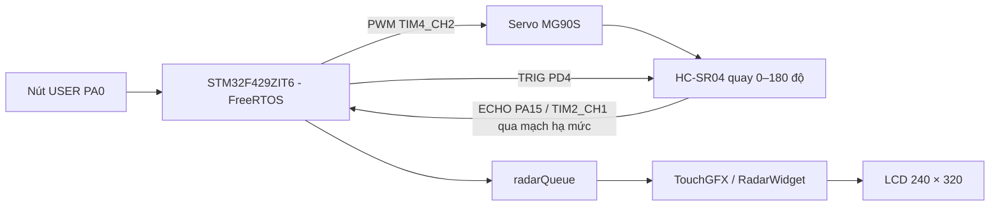
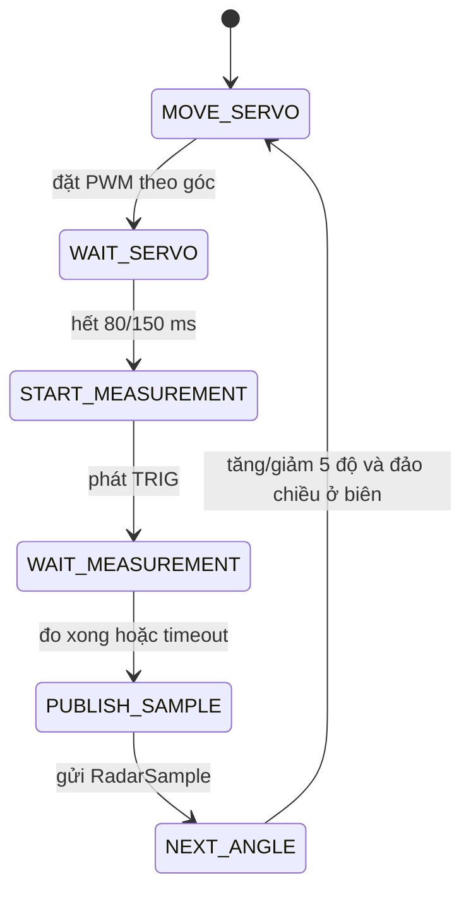
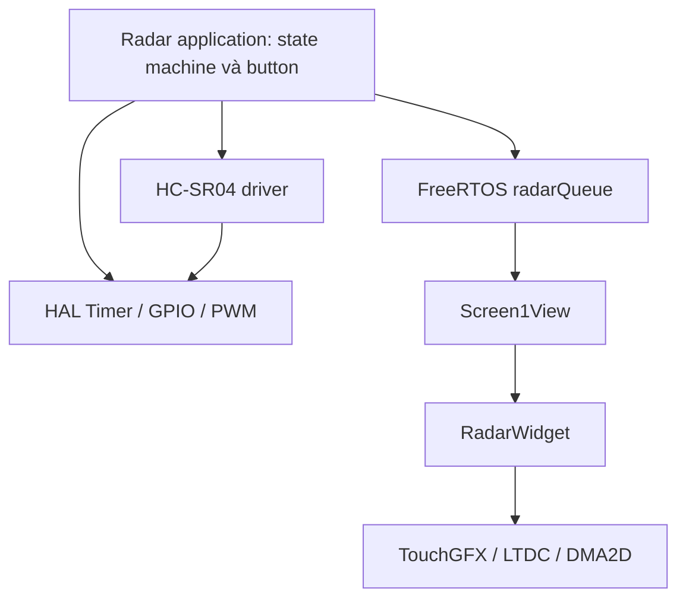

# Radar tầm ngắn - STM32F429I-DISC1 + HC-SR04 + MG90S + TouchGFX

> Báo cáo đồ án hệ nhúng: thiết kế hệ thống radar tầm ngắn dùng cảm biến siêu âm, cơ cấu quét servo và giao diện đồ họa thời gian thực.

**Repository:** [Hungcuong2005/ShortRangeRadar](https://github.com/Hungcuong2005/ShortRangeRadar)

## Tóm tắt

Dự án xây dựng một mô hình radar tầm ngắn trên bo mạch STM32F429I-DISC1. Servo MG90S quay cảm biến HC-SR04 trong dải 0°–180°, vi điều khiển đo thời gian phản hồi của sóng siêu âm rồi gửi mẫu gồm góc quét và khoảng cách tới giao diện TouchGFX. Hệ thống dùng FreeRTOS và hàng đợi bản tin để tách tác vụ đo/điều khiển khỏi tác vụ giao diện, nhờ đó quá trình quét không làm treo màn hình.

Phần mềm hiện thực hai tốc độ quét FAST/SLOW, lựa chọn bằng nút USER; hiển thị góc, khoảng cách, trạng thái phát hiện và vệt mục tiêu trên màn hình radar bán nguyệt 240 × 180 px. Báo cáo này phản ánh đúng mã nguồn hiện có; các chức năng như còi, UART debug, nhiều màn hình hoặc nhiều dải góc quét chưa được xem là đã triển khai.

## Mục lục

1. [Giới thiệu](#1-giới-thiệu)
2. [Tác giả](#2-tác-giả)
3. [Môi trường hoạt động](#3-môi-trường-hoạt-động)
4. [Sơ đồ khối và kết nối](#4-sơ-đồ-khối-và-kết-nối)
5. [Nguyên lý hoạt động](#5-nguyên-lý-hoạt-động)
6. [Tích hợp và vận hành](#6-tích-hợp-và-vận-hành)
7. [Kiến trúc phần mềm](#7-kiến-trúc-phần-mềm)
8. [Đặc tả module và hàm chính](#8-đặc-tả-module-và-hàm-chính)
9. [Kết quả](#9-kết-quả)
10. [Đánh giá thực tế và giới hạn](#10-đánh-giá-thực-tế-và-giới-hạn)
11. [Khó khăn và kinh nghiệm](#11-khó-khăn-và-kinh-nghiệm)
12. [Hướng phát triển](#12-hướng-phát-triển)
13. [Tài liệu tham khảo](#13-tài-liệu-tham-khảo)
14. [Kết luận](#14-kết-luận)

---

## 1. Giới thiệu

### 1.1. Bài toán

Radar siêu âm là mô hình phù hợp để minh họa việc phối hợp cảm biến, cơ cấu chấp hành, bộ định thời, hệ điều hành thời gian thực và giao diện nhúng. Yêu cầu của dự án là:

- Điều khiển servo quét từ 0° đến 180° và quay lại.
- Phát xung TRIG, đo độ rộng xung ECHO của HC-SR04 bằng Input Capture.
- Quy đổi thời gian bay của sóng siêu âm thành khoảng cách.
- Truyền dữ liệu đo sang giao diện mà không làm nghẽn tác vụ quét.
- Hiển thị vị trí mục tiêu, góc, khoảng cách và trạng thái theo thời gian thực.
- Cho phép chọn tốc độ quét bằng nút USER trên bo mạch.

### 1.2. Chức năng đã triển khai

| Nhóm | Chức năng |
| --- | --- |
| Điều khiển | Servo quét 0°–180°, bước 5°, tự đảo chiều tại hai đầu |
| Đo khoảng cách | Kích HC-SR04, bắt cạnh lên/xuống ECHO, có timeout |
| Chế độ quét | FAST: chờ servo 80 ms; SLOW: chờ servo 150 ms |
| Tương tác | Nhấn giữ nút USER để vào chọn tốc độ, nhấn ngắn để đổi FAST/SLOW |
| Giao tiếp tác vụ | Hàng đợi FreeRTOS dài 8 phần tử, ưu tiên mẫu mới |
| Giao diện | Radar bán nguyệt, tia quét, lưới 25–100 cm, vệt mục tiêu |
| Trạng thái | Góc, khoảng cách, SCANNING/TARGET và đèn trạng thái trên màn hình |

### 1.3. Cấu trúc phần mã nguồn chính

```text
ShortRangeRadar/
├── Core/
│   ├── Inc/
│   │   ├── hcsr04.h
│   │   └── radar_app.h
│   └── Src/
│       ├── hcsr04.c
│       └── main.c
├── TouchGFX/
│   ├── gui/include/gui/common/RadarWidget.hpp
│   ├── gui/src/common/RadarWidget.cpp
│   ├── gui/include/gui/screen1_screen/Screen1View.hpp
│   └── gui/src/screen1_screen/Screen1View.cpp
├── STM32F429I_DISCO_REV_D01.ioc
└── TouchGFX/ShortRangeRadar.touchgfx
```

---

## 2. Tác giả

> Cần thay các trường trong ngoặc vuông bằng thông tin thật trước khi nộp báo cáo.

| STT | Họ và tên | Mã sinh viên | Email | Phần việc |
| ---: | --- | --- | --- | --- |
| 1 | [Họ tên] | [MSSV] | [Email] | Cấu hình STM32, Timer, PWM và Input Capture |
| 2 | [Họ tên] | [MSSV] | [Email] | Driver HC-SR04, state machine và FreeRTOS |
| 3 | [Họ tên] | [MSSV] | [Email] | TouchGFX, RadarWidget và kiểm thử |

**Lớp học phần:** [Điền lớp học phần]  
**Giảng viên hướng dẫn:** [Điền tên giảng viên]  
**Thời gian thực hiện:** [Điền thời gian]

---

## 3. Môi trường hoạt động

### 3.1. Phần cứng

| Thiết bị | Vai trò |
| --- | --- |
| STM32F429I-DISC1 | Bộ xử lý trung tâm, màn hình LCD-TFT tích hợp |
| STM32F429ZIT6 | Cortex-M4F, xung nhịp hệ thống 180 MHz |
| HC-SR04 | Cảm biến siêu âm đo khoảng cách |
| MG90S | Servo quay cảm biến theo góc quét |
| Nguồn 5 V ngoài | Cấp dòng ổn định cho servo và cảm biến |
| Mạch chia áp/level shifter | Hạ mức ECHO từ 5 V xuống mức an toàn cho STM32 |

### 3.2. Công cụ và thư viện

| Thành phần | Phiên bản/cấu hình trong dự án |
| --- | --- |
| STM32CubeMX | 6.17.0 |
| STM32CubeF4 | FW_F4 V1.28.2 |
| TouchGFX | 4.25.0 |
| FreeRTOS | CMSIS-RTOS v2 |
| Trình biên dịch | GNU Arm Embedded Toolchain do TouchGFX cung cấp |
| Định dạng màn hình | 240 × 320, RGB565, double buffering |

### 3.3. Cấu hình ngoại vi quan trọng

| Ngoại vi | Cấu hình |
| --- | --- |
| TIM2 CH1 | Input Capture ECHO, tick 1 µs, bộ đếm 32 bit |
| TIM4 CH2 | PWM servo, 50 Hz, chu kỳ 20 ms |
| GPIO PD4 | Ngõ ra TRIG |
| GPIO PA15 | TIM2_CH1, ngõ vào ECHO |
| GPIO PB7 | TIM4_CH2, PWM servo |
| GPIO PA0 | Nút USER/WKUP |
| LTDC + DMA2D | Hiển thị và tăng tốc đồ họa |
| SDRAM | Framebuffer và dữ liệu đồ họa |

### 3.4. Tác vụ FreeRTOS

| Tác vụ | Độ ưu tiên | Stack | Trách nhiệm |
| --- | --- | ---: | --- |
| `defaultTask` | Normal | 512 byte | State machine quét, nút USER, HC-SR04, publish mẫu |
| `GUI_Task` | Normal | 32 KiB | Chạy vòng lặp TouchGFX |

Hàng đợi `radarQueue` có độ dài 8, mỗi phần tử mang một `RadarSample`.

---

## 4. Sơ đồ khối và kết nối

### 4.1. Sơ đồ khối



### 4.2. Bảng nối dây

| Thiết bị | Chân thiết bị | STM32F429I-DISC1 | Ghi chú |
| --- | --- | --- | --- |
| HC-SR04 | VCC | 5 V | Dùng nguồn ổn định |
| HC-SR04 | GND | GND | Chung mass với bo mạch và servo |
| HC-SR04 | TRIG | PD4 | GPIO Output |
| HC-SR04 | ECHO | PA15/TIM2_CH1 | Phải hạ mức 5 V trước khi vào MCU |
| MG90S | Signal | PB7/TIM4_CH2 | PWM 50 Hz |
| MG90S | VCC | 5 V ngoài | Không nên lấy dòng servo trực tiếp từ chân 5 V yếu |
| MG90S | GND | GND | Bắt buộc chung mass |

### 4.3. Lưu ý lắp mạch

- ECHO của HC-SR04 thường ở mức 5 V; nên dùng cầu chia điện trở hoặc bộ chuyển mức logic trước PA15.
- Servo có thể tạo sụt áp và nhiễu khi khởi động. Nên dùng nguồn 5 V đủ dòng, tụ lọc gần servo và nối chung GND.
- Cảm biến phải được cố định chắc trên càng servo; sai lệch cơ khí sẽ làm góc hiển thị khác góc thực.
- Dây ECHO/TRIG nên ngắn và tránh đi sát dây nguồn servo.

### 4.4. Hình ảnh cần bổ sung khi nộp

| Hình | Nội dung |
| --- | --- |
| Hình 1 | Sơ đồ nguyên lý/mạch chia áp ECHO |
| Hình 2 | Ảnh lắp ráp STM32 + HC-SR04 + MG90S |
| Hình 3 | Ảnh giao diện khi không có mục tiêu |
| Hình 4 | Ảnh giao diện khi phát hiện mục tiêu |

---

## 5. Nguyên lý hoạt động

### 5.1. Chu trình quét

Tác vụ điều khiển không chờ chặn trong một lần đo dài. Thay vào đó, chương trình đi qua các trạng thái nhỏ và nhường CPU bằng `osDelay(1)`.



Dải quét có 37 vị trí: 0°, 5°, 10°, ..., 180°. Khi tới 0° hoặc 180°, biến hướng được đảo để tạo chuyển động qua lại liên tục.

### 5.2. Đo khoảng cách bằng HC-SR04

Mỗi phép đo gồm:

1. Đưa TRIG xuống thấp 2 µs.
2. Đưa TRIG lên cao 10 µs rồi hạ xuống.
3. TIM2 bắt cạnh lên của ECHO để ghi thời điểm bắt đầu.
4. TIM2 bắt cạnh xuống để tính độ rộng xung, đơn vị 1 µs.
5. Chuyển độ rộng xung sang khoảng cách:

```text
distance_mm = pulse_width_us × 10 / 58
```

Công thức tương đương xấp xỉ `distance_cm = pulse_width_us / 58`. Driver chấp nhận khoảng 20–4000 mm. Timeout nội bộ là 30 ms; state machine có ngưỡng bảo vệ 35 ms để tránh kẹt khi mất ECHO.

### 5.3. Điều khiển servo

TIM4 tạo PWM 50 Hz. Mã nguồn ánh xạ tuyến tính góc sang độ rộng xung:

| Góc | Độ rộng xung |
| ---: | ---: |
| 0° | 550 µs |
| 90° | 1500 µs |
| 180° | 2450 µs |

Hai chế độ chỉ thay đổi thời gian chờ servo ổn định trước khi đo:

| Chế độ | Thời gian chờ mỗi bước | Đặc điểm |
| --- | ---: | --- |
| FAST | 80 ms | Quét nhanh, tốc độ cập nhật cao hơn |
| SLOW | 150 ms | Servo có thêm thời gian ổn định |

### 5.4. Xử lý nút USER

- Chống dội cả nhấn và thả: 30 ms.
- Khi radar đang chạy, nhấn giữ từ 1000 ms để vào trạng thái chọn tốc độ và tạm dừng quét.
- Trong màn hình chọn tốc độ, nhấn ngắn để đổi FAST/SLOW rồi quay lại chạy.

---

## 6. Tích hợp và vận hành

### 6.1. Tạo mã và biên dịch

1. Mở `STM32F429I_DISCO_REV_D01.ioc` bằng STM32CubeMX 6.17.0 hoặc phiên bản tương thích.
2. Kiểm tra cấu hình clock, TIM2, TIM4, FreeRTOS, LTDC, DMA2D và TouchGFX.
3. Generate Code nếu thay đổi cấu hình phần cứng.
4. Mở `TouchGFX/ShortRangeRadar.touchgfx` bằng TouchGFX Designer 4.25.0 nếu cần chỉnh giao diện.
5. Biên dịch target phần cứng trong môi trường TouchGFX/GNU Arm.
6. Nạp tệp `intflash.hex` hoặc `target.elf` qua ST-LINK.

> Middleware và toolchain dung lượng lớn không nhất thiết phải đưa lên Git. Người dùng cần cài đúng STM32CubeF4/TouchGFX theo phiên bản ở trên trước khi build.

### 6.2. Trình tự chạy

1. Cấp nguồn cho bo mạch, HC-SR04 và servo; xác nhận tất cả dùng chung GND.
2. Sau khởi tạo, servo bắt đầu quét dải 0°–180°.
3. Giao diện nhận mẫu mới và cập nhật tia quét, số đo và vệt mục tiêu.
4. Đặt vật trong phạm vi hiển thị 20–1000 mm để quan sát trạng thái TARGET.
5. Nhấn giữ USER khoảng 1 giây để mở chọn tốc độ; nhấn ngắn để chuyển chế độ.

### 6.3. Dữ liệu đầu ra

Mỗi mẫu đo có ba trường:

```c
typedef struct
{
    uint16_t angle_deg;
    uint16_t distance_mm;
    uint8_t  valid;
} RadarSample;
```

`valid` cho biết phép đo có hợp lệ hay không. Giao diện chỉ coi vật nằm trong khoảng 20–1000 mm là mục tiêu để vẽ trên radar.

---

## 7. Kiến trúc phần mềm

### 7.1. Phân lớp



- **HAL/driver:** cấu hình chân, timer, PWM và bắt xung ECHO.
- **Application:** quản lý trạng thái quét, hướng quét, timeout, nút bấm và chế độ tốc độ.
- **RTOS/IPC:** truyền mẫu đo từ tác vụ radar sang giao diện bằng message queue.
- **Presentation:** `Screen1View` lấy mẫu mới nhất, còn `RadarWidget` chịu trách nhiệm vẽ.

### 7.2. Chính sách hàng đợi

Khi hàng đợi đầy, tác vụ radar loại bỏ phần tử cũ nhất rồi đưa mẫu mới vào. Ở phía GUI, chương trình đọc hết các phần tử đang chờ và chỉ dùng mẫu cuối. Chính sách này phù hợp với dữ liệu thời gian thực: trạng thái hiện tại quan trọng hơn việc hiển thị lại mọi mẫu đã cũ.

### 7.3. Cơ chế lưu vết mục tiêu

`RadarWidget` duy trì 37 ô phát hiện, tương ứng 37 góc quét. Mỗi điểm có tuổi tối đa 72 mẫu và mờ dần:

| Tuổi mẫu | Mức đỏ |
| ---: | ---: |
| 0–8 | 255 |
| 9–24 | 170 |
| 25–48 | 100 |
| 49–72 | 50 |
| Trên 72 | Xóa |

Tia quét có 5 lớp vệt để tạo hiệu ứng chuyển động. Các phép sin/cos dùng bảng tra cứu số nguyên với hệ số 1024, giảm chi phí tính toán dấu phẩy động.

### 7.4. Lọc hiển thị

Để tránh nhấp nháy do một mẫu mất ECHO ngắn:

- Giữ trạng thái mục tiêu 5 mẫu ở FAST và 3 mẫu ở SLOW.
- Giữ giá trị khoảng cách 3 mẫu ở FAST và 2 mẫu ở SLOW.

---

## 8. Đặc tả module và hàm chính

### 8.1. Driver HC-SR04

Tệp: [`Core/Inc/hcsr04.h`](Core/Inc/hcsr04.h), [`Core/Src/hcsr04.c`](Core/Src/hcsr04.c)

| Hàm | Chức năng |
| --- | --- |
| `HCSR04_StartMeasurement()` | Kiểm tra driver rảnh, phát xung TRIG và chuẩn bị Input Capture |
| `HCSR04_GetResult()` | Trả kết quả khi đã bắt đủ hai cạnh ECHO |
| `HCSR04_ProcessTimeout()` | Kết thúc phép đo nếu quá thời gian cho phép |
| `HAL_TIM_IC_CaptureCallback()` | Xử lý cạnh lên/cạnh xuống từ TIM2 CH1 |

`HCSR04_Result` chứa độ rộng xung, khoảng cách và cờ hợp lệ. Driver chỉ cho phép một phép đo đang diễn ra tại một thời điểm.

### 8.2. Ứng dụng radar và điều khiển servo

Tệp: [`Core/Src/main.c`](Core/Src/main.c), [`Core/Inc/radar_app.h`](Core/Inc/radar_app.h)

| Hàm/thành phần | Chức năng |
| --- | --- |
| `Servo_SetPulseUs()` | Ghi độ rộng xung PWM vào TIM4 CH2 |
| `Servo_SetAngleDeg()` | Giới hạn và ánh xạ góc 0°–180° sang 550–2450 µs |
| `StartDefaultTask()` | Chạy state machine radar, xử lý nút và publish mẫu |
| `RadarScanState` | Liệt kê sáu trạng thái của một bước quét |
| `RadarSample` | Kiểu dữ liệu trao đổi giữa tác vụ radar và GUI |

Trong mã còn có chế độ hiệu chuẩn servo được điều khiển bởi `RADAR_CALIBRATION_MODE`. Giá trị mặc định là 0 nên chế độ này không chạy trong bản firmware thông thường.

### 8.3. Giao diện màn hình

Tệp: [`Screen1View.cpp`](TouchGFX/gui/src/screen1_screen/Screen1View.cpp)

| Hàm | Chức năng |
| --- | --- |
| `Screen1View::setupScreen()` | Khởi tạo trạng thái, nhãn và vùng hiển thị |
| `Screen1View::handleTickEvent()` | Lấy mẫu mới nhất từ queue và cập nhật giao diện |
| `Screen1View::tearDownScreen()` | Kết thúc màn hình theo vòng đời TouchGFX |

Màn hình chính đồng thời quản lý lớp phủ chọn FAST/SLOW. Đây là một màn hình với trạng thái hiển thị khác nhau, không phải nhiều screen độc lập.

### 8.4. RadarWidget

Tệp: [`RadarWidget.hpp`](TouchGFX/gui/include/gui/common/RadarWidget.hpp), [`RadarWidget.cpp`](TouchGFX/gui/src/common/RadarWidget.cpp)

| Hàm | Chức năng |
| --- | --- |
| `setSample()` | Nhận góc, khoảng cách, cờ hợp lệ và cập nhật vệt quét |
| `getCoordinates()` | Đổi góc/bán kính sang tọa độ màn hình bằng bảng sin/cos |
| `updateDetectionDots()` | Tăng tuổi, giảm cường độ và xóa điểm mục tiêu cũ |

Widget có kích thước 240 × 180 px, nền đen, lưới 25/50/75/100 cm và các mốc 0°/45°/90°/135°/180°. Macro `RADAR_WIDGET_TEST_MODE` mặc định bằng 0; có thể bật khi cần thử phần vẽ không dùng cảm biến thật.

---

## 9. Kết quả

### 9.1. Kết quả biên dịch

Mã nguồn đã được kiểm tra bằng bản TouchGFX 4.25 tương ứng và biên dịch thành công cho target phần cứng. Hai đầu ra chính là `target.elf` và `intflash.hex`.

| Vùng nhớ | Đã dùng | Tổng dung lượng | Tỷ lệ |
| --- | ---: | ---: | ---: |
| RAM | 96.800 byte | 192 KiB | 49,24% |
| FLASH | 173.228 byte | 2 MiB | 8,26% |
| SDRAM | 450 KiB | 8 MiB | 5,49% |

Sau khi build, mã sinh tự động không tạo ra thay đổi ngoài dự kiến. Điều này cho thấy cấu hình TouchGFX/CubeMX và phần mã người dùng đang nhất quán.

### 9.2. Kết quả chức năng từ mã nguồn

| Nội dung | Trạng thái | Căn cứ |
| --- | --- | --- |
| Quét 0°–180° hai chiều | Đã triển khai | State machine và bước góc trong `main.c` |
| Đo HC-SR04 bằng Input Capture | Đã triển khai | `hcsr04.c`, TIM2 CH1 |
| Hai tốc độ FAST/SLOW | Đã triển khai | Thời gian chờ 80/150 ms |
| Điều khiển bằng nút USER | Đã triển khai | Debounce và long-press trong tác vụ radar |
| Truyền dữ liệu qua FreeRTOS queue | Đã triển khai | `radarQueue`, độ dài 8 |
| Hiển thị radar và vệt mục tiêu | Đã triển khai | `Screen1View` và `RadarWidget` |
| Còi cảnh báo | Chưa triển khai | Không có driver hoặc logic buzzer |
| UART debug | Chưa triển khai | Không có luồng log UART của ứng dụng |

### 9.3. Kiểm thử phần cứng cần ghi nhận

Kết quả build không thay thế cho kiểm thử trên bo mạch. Khi hoàn thiện báo cáo, cần đo và điền bảng sau:

| Bài thử | Kết quả mong đợi | Kết quả đo thực tế |
| --- | --- | --- |
| Vật ở 20 cm, góc 45° | Sai số khoảng cách trong mức chấp nhận, điểm đúng góc | [Điền] |
| Vật ở 50 cm, góc 90° | Hiển thị TARGET và vệt đỏ gần vòng 50 cm | [Điền] |
| Vật ở 100 cm, góc 135° | Mục tiêu nằm gần biên hiển thị | [Điền] |
| Không có ECHO | Không treo tác vụ; mẫu hết hạn sau timeout | [Điền] |
| Chuyển FAST/SLOW | Tốc độ quét thay đổi, GUI tiếp tục phản hồi | [Điền] |
| Chạy liên tục 10 phút | Không reset, không kẹt servo hoặc giao diện | [Điền] |

Nên quay một video ngắn thể hiện vật thay đổi vị trí, servo quét và màn hình cập nhật đồng thời; thêm liên kết video vào mục này.

---

## 10. Đánh giá thực tế và giới hạn

### 10.1. Điểm đạt được

- Kiến trúc tách phần đo/điều khiển và phần giao diện rõ ràng.
- State machine không blocking giúp GUI và các tác vụ khác tiếp tục chạy.
- Queue có chính sách bỏ mẫu cũ, phù hợp với dữ liệu cảm biến thời gian thực.
- Input Capture cho kết quả thời gian chính xác hơn cách thăm dò GPIO bằng vòng lặp.
- Widget dùng số nguyên và bảng tra cứu lượng giác, phù hợp với tài nguyên MCU.
- Timeout ở cả driver và ứng dụng giúp hệ thống tự phục hồi khi mất ECHO.

### 10.2. Giới hạn hiện tại

- HC-SR04 phụ thuộc bề mặt, góc phản xạ, nhiệt độ và nhiễu âm; vật mềm hoặc đặt chéo có thể không phản hồi.
- Dải hiển thị mục tiêu đang giới hạn ở 20–1000 mm dù driver chấp nhận tới 4000 mm.
- Góc servo dùng ánh xạ cố định 550–2450 µs; từng servo có thể cần hiệu chuẩn riêng.
- Chưa có bộ lọc thống kê nhiều mẫu như median hoặc Kalman.
- Chưa lưu nhật ký đo và chưa có kênh UART/Bluetooth/Wi-Fi để quan sát từ máy tính.
- Giao diện hiện chỉ có một màn hình chính và lớp phủ chọn tốc độ.
- Chưa có số liệu thực nghiệm trong repository để đánh giá sai số và độ lặp lại.
- Nguồn servo và mức điện áp ECHO cần được thiết kế đúng để tránh reset hoặc hỏng chân MCU.

---

## 11. Khó khăn và kinh nghiệm

### 11.1. Những vấn đề kỹ thuật chính

| Vấn đề | Nguyên nhân thường gặp | Cách xử lý trong dự án/khuyến nghị |
| --- | --- | --- |
| ECHO không về | Vật ngoài tầm, dây sai hoặc phản xạ kém | Timeout 30/35 ms, trả mẫu không hợp lệ |
| Servo rung/reset bo | Nguồn không đủ dòng, nhiễu nguồn | Dùng nguồn 5 V riêng, chung GND, thêm tụ lọc |
| Khoảng cách dao động | Nhiễu âm và servo chưa ổn định | Chờ 80/150 ms; có thể bổ sung median filter |
| GUI chậm hơn luồng đo | Tác vụ GUI bận render | Queue bỏ mẫu cũ và lấy mẫu mới nhất |
| Vệt mục tiêu nhấp nháy | Một vài mẫu ECHO bị mất | Cơ chế hold và tuổi điểm trong RadarWidget |
| Mã sinh bị ghi đè | Chỉnh trực tiếp vùng do CubeMX/TouchGFX quản lý | Đặt mã tùy biến trong USER CODE hoặc tệp riêng |

### 11.2. Kinh nghiệm rút ra

- Tách driver cảm biến, logic ứng dụng và giao diện giúp kiểm thử và bảo trì dễ hơn.
- Với dữ liệu thời gian thực, cần ưu tiên độ mới thay vì cố hiển thị đủ mọi mẫu.
- Timeout là bắt buộc đối với thiết bị ngoại vi có thể không phản hồi.
- Cần kiểm tra điện áp logic và ngân sách dòng trước khi nối module 5 V với MCU 3,3 V.
- Nên hiệu chuẩn giới hạn xung servo trên từng cơ cấu để tránh ép cơ khí ở hai đầu.
- Kết quả build chỉ xác nhận tính nhất quán của phần mềm; báo cáo tốt vẫn cần số liệu đo trên phần cứng.

---

## 12. Hướng phát triển

1. **Hiệu chuẩn tự động:** lưu xung servo tại 0°/90°/180° và hệ số khoảng cách vào Flash.
2. **Lọc dữ liệu:** dùng median 3–5 mẫu, loại ngoại lai và bù vận tốc âm theo nhiệt độ.
3. **Nhiều dải hiển thị:** cho phép chọn 50 cm, 100 cm, 200 cm hoặc toàn dải.
4. **Nhiều chế độ góc quét:** thêm 90°/120° và vùng quan tâm để tăng tốc cập nhật.
5. **Cảnh báo:** bổ sung buzzer/LED vật lý với ngưỡng khoảng cách cấu hình được.
6. **Truyền dữ liệu:** gửi góc và khoảng cách qua UART, USB CDC, Bluetooth hoặc Wi-Fi.
7. **Ghi log và thống kê:** lưu dữ liệu CSV để tính sai số trung bình, độ lệch chuẩn và độ lặp lại.
8. **Kiểm thử tự động:** tách state machine khỏi HAL để chạy unit test trên máy tính.
9. **Cải thiện giao diện:** thêm màn hình cấu hình, biểu đồ lịch sử và trạng thái lỗi cảm biến.
10. **Cơ khí và nguồn:** thiết kế gá cảm biến, PCB chuyển mức và nguồn servo chuyên dụng.

---

## 13. Tài liệu tham khảo

### 13.1. Tài liệu chính hãng

1. [STM32F427xx/STM32F429xx Datasheet - STMicroelectronics](https://www.st.com/resource/en/datasheet/stm32f429zi.pdf)
2. [STM32F429I-DISC1 schematic - STMicroelectronics](https://www.st.com/resource/en/schematic_pack/mb1075-f429i-e01_schematic.pdf)
3. [Getting started with STM32F429 Discovery - STMicroelectronics](https://www.st.com/resource/en/user_manual/dm00097320-getting-started-with-stm32f429-discovery-software-development-tools-stmicroelectronics.pdf)
4. [TouchGFX Documentation 4.25](https://support.touchgfx.com/4.25/docs/introduction/welcome)
5. [CMSIS-RTOS2 Message Queue API - Arm](https://arm-software.github.io/CMSIS_6/latest/RTOS2/group__CMSIS__RTOS__Message.html)
6. [HC-SR04 Datasheet](https://www.alldatasheet.com/datasheet-pdf/view/1132204/ETC2/HCSR04.html)
7. [MG90S Datasheet](https://www.alldatasheet.com/html-pdf/1132104/ETC2/MG90S/109/1/MG90S.html)

### 13.2. Mã nguồn và tài liệu dự án

1. [Repository ShortRangeRadar](https://github.com/Hungcuong2005/ShortRangeRadar)
2. [README tham khảo IT4210-HE-NHUNG](https://github.com/phamhungcrab/IT4210-HE-NHUNG)
3. [Cấu hình CubeMX của dự án](STM32F429I_DISCO_REV_D01.ioc)
4. [Cấu hình TouchGFX của dự án](TouchGFX/ShortRangeRadar.touchgfx)

> README tham khảo chỉ được dùng để định hướng bố cục báo cáo. Thông số và chức năng trong tài liệu này được đối chiếu theo mã nguồn ShortRangeRadar.

---

## 14. Kết luận

Dự án đã xây dựng được nền tảng radar tầm ngắn hoàn chỉnh ở mức mô hình nhúng: STM32F429 điều khiển servo quét, đo HC-SR04 bằng Input Capture, tổ chức luồng xử lý bằng FreeRTOS và hiển thị trực quan bằng TouchGFX. Kiến trúc state machine và queue giúp phần cảm biến độc lập tương đối với tốc độ dựng hình, đồng thời timeout và cơ chế giữ mẫu giúp hệ thống ổn định hơn trước dữ liệu không liên tục.

Mã nguồn đã biên dịch thành công và còn nhiều dư địa bộ nhớ để mở rộng. Trước khi nộp, nhóm cần bổ sung thông tin thành viên, sơ đồ mạch thực tế, ảnh/video sản phẩm và bảng số liệu kiểm thử để báo cáo phản ánh đầy đủ cả kết quả phần mềm lẫn phần cứng.
